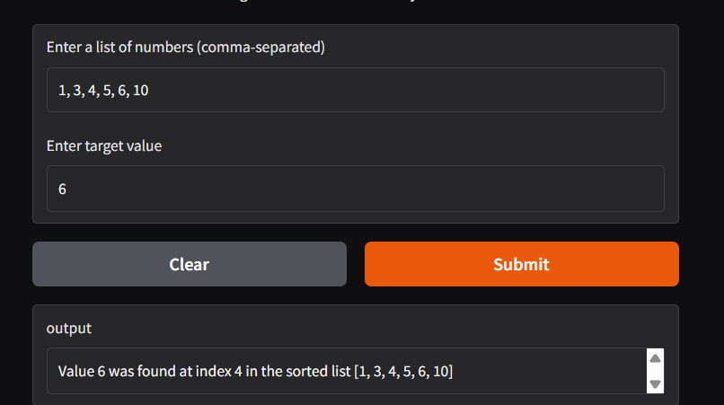
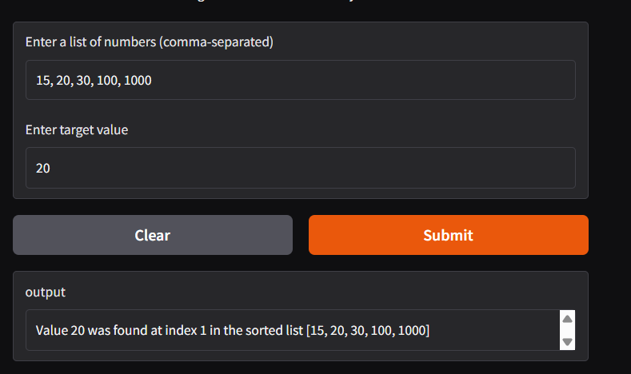
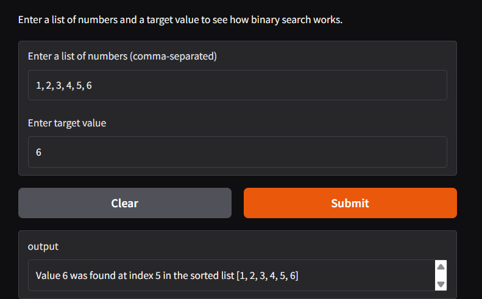

# Binary Search Simulator

## Demo Screenshot of Test




## Problem Breakdown & Computational Thinking

**Decomposition:**
- Accept a list of numbers from the user
- Accept a target value
- Sort the list to prepare for binary search
- Repeatedly compare the middle value to the target
- Narrow the search range until the value is found or the list is empty
- Display the result to the user

**Pattern Recognition:**
- The algorithm repeatedly compares the middle value of the current range
- The search space is reduced by half on every comparison
- This halving pattern continues until the value is found or eliminated

**Abstraction:**
- The user only interacts with a list and a target value
- All internal calculations and comparisons are hidden
- The user only sees the final result (found or not found)

**Algorithm Design:**
- **Input:** A list of numbers and a target value
- **Processing:** Apply binary search by halving the search space repeatedly
- **Output:** The index of the target value if found, otherwise -1

---

## Steps to Run

1. Clone the GitHub repository  
2. Install the required library:
   ```bash
   pip install gradio
3. Run the application:
    python app.py
4. Enter a comma-seperated list of numbers and a target value
5. Click submit to view the results